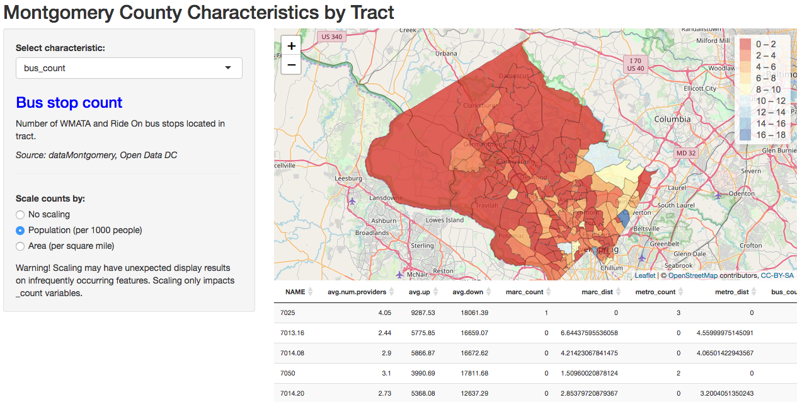

```{r setup, include = FALSE}
library(knitr)
library(tidyverse)
library(stringr)
library(pdftools)
library(magrittr)
library(xtable)
library(cowplot)
library(sf)

mocodata <- read_rds("/Users/brightsideofthedark/Documents/727project/homevalues/mocodata_with_scores.rds")
```

# Motivation

Montgomery County, Maryland is one of the richest counties in the United States [@ACS2018], but much of that wealth is concentrated in the southwest of the county, with affluence generally decreasing aross the east-west axis (and to some degree, south-north) [@WaPo2014]. Correspondingly, neighborhoods in the southwest tend to pay disproportionately more in taxes, which are then redistributed across the county based on need [@Lublin2019]. 

But despite this redistribution, there remains a significant perceived east-west divide in quality of life and services.

In theory, there is a happy medium - somewhere where the tax burden is most in-proportion to the government services and resources available, as well as other quality-of-life factors. This project aimed to identify the neighborhoods that best match this criteria. 

# Data

For this project, I focused solely on property taxes, rather than income taxes or other kinds of taxes. This is partially due to data availability: While individual income taxes are confidential, individual property tax records are public record, allowing for granular sub-county analyses. Conveniently, these taxes represent roughly equal shares of total county revenue [@Moco2018]. This is useful in that property taxes are responsible for a significant share of the funding for county services.

Property taxes are not always being levied on the most current value of the home. In addition to assessments done at the homeowner's request for various purposes, the Maryland government re-assess the value properties on a three-year rolling schedule [@MDAssess]. This allows for homes to appreciate in value - due to structural improvements or neighborhood trends - without a corresponding property tax increase for up to three years, which opens up more opportunities for discrepancies between property taxes and the general "value" of the area or home. These are explored later in the project.

Neighborhoods were operationalized as census tracts, as a sub-county geographic unit used by the U.S. Census Bureau. This has the advantage of making a wealth of data available, but has the disadvantage that census tracts do not have any practical meaning and do not always align with the boundaries of commonly-accepted neighborhoods. While some neighborhood shapefiles are available for urban areas with well-defined neighborhoods (e.g. New York), no neighborhood-level shape information was available for Montgomery County. 

## Sources

Data were collected from a wide variety of sources and aggregated at the tract level.

*U.S. Census Bureau:*

* Shapefiles for Montgomery County tracts
* Median home values (ACS, 2013-2017 5-year estimates)
* Population (ACS, 2013-2017 5-year estimates)
* Demographics (median age, race and ethnicity, citizenship, mobility, household type) (ACS, 2013-2017 5-year estimates)

*Open Data DC:*

* WMATA Metrobus stops
* WMATA Metro stations

*Maryland iMAP:*

* Broadband internet information (up/down speeds, providers per census block)
* MVA and VEIP facilities
* Municipal, county and state police station locations
* Municipal and county fire station locations
* MARC train stops

*dataMontgomery:*

* 2018 property taxes
* Local hospitals (Montgomery County and neighboring areas)
* Montgomery County RideOn bus stops
* Bikeways
* Publicly reservable spaces (community facilities)
* Early voting centers
* Polling places
* Reported crimes

*Montgomery County Public Schools (MCPS):*

* High school boundaries
* Academic scores and demographic information by high school

*Bureau of Transportation Statistics:*

* Urbanicity

## Cleaning

Most data were already in GeoJSON or similar format such that they could easily be aggregated by census tract.

```{r bikeways example, eval=FALSE}
bikeways <- 
  st_read("https://data.montgomerycountymd.gov/api/geospatial/icc2-ppee?method=export&format=GeoJSON") %>% 
  st_transform(crs=4269)
# Intersect with the tract information to get the total mileage within each tract
bikeways %<>% st_intersection(mocotracts,.) %>% 
  mutate(distance = st_length(geometry)) %>% 
  group_by(TRACTCE) %>% summarize(totaldistance = sum(distance)) %>% 
  st_drop_geometry # Dropping geometry for simplicity
```

Others required more data processing. For example, MCPS does not (as of writing) provide school-level academic information in a machine-readable format, but does so in a large PDF report (Schools at a Glance). This required parsing the PDF and manually identifying the character locations of the desired fields.

```{r mcpsdata, cache=TRUE}
saag_full <-
  pdf_text("https://www.montgomeryschoolsmd.org/departments/regulatoryaccountability/glance/currentyear/SAAG2018.pdf")
# Isolate the high schools
saag_hs <- saag_full[370:421]
# Remove Thomas Edison since non-trad HS
saag_hs <- saag_hs[-c(13,14)]

# Very long regexes here will overrun the margins
hsp1<-
  str_match_all(string=saag_hs,
      pattern=regex("^ +([A-Za-z- \\.]+High School)[\\s\\S]+Enrollment = ([0-9,]+)[\\s\\S]+ESOL +([0-9.≤]+)[\\s\\S]+FARMS +([0-9.≤]+)[\\s\\S]+Graduation Rate² ³ = ([0-9.≥]+)%[\\s\\S]+Requirements² ³ = ([0-9.≥]+)%",
                multiline=TRUE))
hsp2<-
  str_match_all(string=saag_hs,
      pattern=regex("Total\\nSchool\\s+([0-9]{3})\\s+([0-9]{3})\\s+([0-9]{3,4})[\\s\\S]+Paraeducators\\n[\\s0-9]+([0-9\\.]{4})",
                multiline=TRUE))
mcpshs <- 
  hsp1[seq(1,length(saag_hs),2)] %>% sapply(.,function(x) x[2:7]) %>% t %>% 
  cbind(hsp2[seq(2,length(saag_hs),2)] %>% sapply(.,function(x) x[2:5]) %>% t)
colnames(mcpshs)<-
  c("name","enrollment","esol","farms","gradrate","umdreq","satv","satm","satt","apib")
```

This munging eventually returns the desired data table. (Sample of two schools and subset of variables for demonstration purposes.)

```{r mcpstable, results='asis', echo=FALSE}
mcpshs <- mcpshs[1:5,1:5] 
xtable(head(mcpshs),type="latex", caption = "Example subset of cleaned schools data") %>% print(comment=FALSE)
```

Property tax data were limited to those tagged as primary residences. While there is no doubt that similar value scores could be created for businesses or residences rented to others, there are likely additional relevant factors that are out of scope for this initial analysis.

Once collected, data were mapped and explored first ad-hoc and later using an [interactive dashboard](https://sofi.shinyapps.io/sinozich_surv727_assignment6/).

<p>

</p>

One major consideration was how to scale count data - by population or area. In most cases, the population scaling both made more sense conceptually and resulted in a more differentiated distribution. The interactive plot made it much easier to see visually what differences this would make per tract.

# The "value score"

Each tract was assigned a summary "value score" based on four factors. These factors were determined largely by ad-hoc conceptual grouping rather than a rigorous method, but also with the goal of creating meaningful subscores rather than grouping aspects that might be statistically coherent but difficult to parse. Each subscore was rescaled from 0 to 100.

## Subscores

### Schools

Tracts were assigned a schools subscore on the basis of four academic indicators:

1. Total average SAT score (verbal + math)

2. % of graduates scoring here than a 3 (AP) or 4 (IB)

3. % of students meeting University of Maryland entrance requirements

4. Graduation rate

Since tract boundaries do not match school boundaries, school data was taken as the average of all of the schools who serve the tract. Scores scaled for the percentage of English for Speakers of Other Languages (ESOL) students and those eligible for free and reduced price school meals (FARMS) were also created as a way to benefit schools that work with more challenging populations.

```{r schoolscore, eval = FALSE}
mocodata %<>% 
  mutate(score_school = ((satt/160 + apib + umdreq + gradrate)/4) %>% 
                            rescale(to=c(0,100)),
        score_school_esol = (score_school/(1-esol/100)) %>% 
                              rescale(to=c(0,100)),
        score_school_farms = (score_school/(1-farms/100)) %>% 
                              rescale(to=c(0,100))) 
```

### Crime

Crime data within each tract were adjusted by population to create per capita counts and then summed across crime categories: crimes against society, property crime, crimes against people, and other types of crime. The aggregate crime rate was ranked compared with other tracts by deciles, and the percentile subtracted from 1.1 to achieve a 0 to 100 score, where 100 indicates less crime. The use of percentiles rather than raw scores was intended to avoid making artificial distinctions between tracts where the per capita rates differ only slightly, which was deemed more important for crime data than the other subscores.

```{r crimescore,eval=FALSE}
mocodata %<>% 
  mutate(score_crime = 110 - 
           rowMeans(select(.,othercrime,personcrime,propertycrime,societycrime)
                                      %>% st_drop_geometry,na.rm=TRUE) %>%
                       cut(.,
                           quantile(.,probs=seq(0,1,0.1)),
                           labels=FALSE,include.lowest = TRUE) * 10)
```

### Home values

Median home values from each tract were simply rescaled onto a 0 to 100 scale. Two tracts did not have ACS median home value data and were treated as missing for this score.

```{r homevaluescore,eval=FALSE}
mocodata %<>%
  mutate(score_homevalue = rescale(acshomevalue,to=c(0,100)))
```

### Services

Because of the number of items incorporated into the services score, and conceptual groupings among them, sub-subscores were created for the services subscore. There were several opinionated decisions made in this process. For example, not all factors were weighted equally. In transportation, bikeways were downweighted in importance compared with public transit, reflecting the higher popularity and perceived usefulness of public transit in most of the county. In internet, download speed was prioritized over upload speed, which was prioritized over the number of providers, based on assumptions about internet use, and the tract level likely being too small to necessarily require significant ISP competition.

Some factors were scaled by population (location counts) or by land area (bikeway mileage). All were then normalized (using negative distances such that higher indicates closer), summed, and then rescaled to 0 to 100 scales. Finally, all four subscores were averaged to create the final services score.

```{r servicesscore,eval=FALSE}
mocodata %<>% 
  mutate(score_services_transport = 
                          # Number of transit stops (scaled by pop)
                       (1.25*scale((marc_count+metro_count+bus_count)/population) + 
                          # Distance to nearest station (MARC or Metro)
                       1.25*scale(ifelse(marc_dist > metro_dist,-metro_dist,-marc_dist)) + 
                       0.5*scale(totaldistance/ALAND)) %>% rescale(to=c(0,100)))
# Hospital/fire/police subscore
mocodata %<>% 
  mutate(score_services_emergency = 
                       (scale(hospital_count/population) + scale(police_count/population) + 
                          scale(fire_count/population) + scale(-hospital_dist) + 
                          scale(-police_dist) + scale(-fire_dist)) %>% rescale(to=c(0,100)))
# Other facilities subscore
# community faclities, MVA/VEIP, polling places
mocodata %<>% 
  mutate(score_services_facilities = 
                       (scale(mva_count/population) + scale(veip_count/population) + 
                          scale(facil_count/population) + scale(early_count/population) + 
                          scale(poll_count/population) + scale(-mva_dist) + 
                          scale(-veip_dist) + scale(-facil_dist) + scale(-early_dist) + 
                          scale(-poll_dist)) %>% rescale(to=c(0,100)))
# Internet subscore
# Weighted such that better down speeds are most important - think this reflects use
mocodata %<>% 
  mutate(score_services_internet = 
                       .5*scale(avg_num_providers) + 
                       1*scale(avg_up) + 
                       1.5*scale(avg_down) %>% rescale(to=c(0,100)))

mocodata %<>% 
  mutate(score_services = (score_services_transport + score_services_emergency + 
                           score_services_facilities + score_services_transport)/4)
```

# Ranking the tracts on value

While the scores themselves are useful, the motivating question was "who is paying less than expected for their tract value score?" This was calculated from the signed residuals of a simple linear regression predicting the median property tax bill for principal residences in the tract using the value scores. (Mean bill total was also tested and produced similar, though not identical results.) 

Higher residuals indicate higher taxes levied than the value score would predict, while negative residuals indicate lower taxes than predicted by the score. Tracts were then ranked by the residuals (negative residuals are best, best and worst highlighted in chart). As noted, two of the 215 tracts did not have home value data and thus did not receive a score or a rank.

```{r resid plot, warning=FALSE, echo=FALSE, fig.align='center', fig.height = 3}
# Just adding the residuals directly...
mocodata %<>% 
  mutate(valueresid = resid(lm(bill_total_median ~ valuescore,data=mocodata,na.action = na.exclude)),
                       valueresid_mean = resid(lm(bill_total_mean ~ valuescore,data=mocodata,na.action = na.exclude)),
                     valuerankrev = -resid(lm(bill_total_median ~ valuescore,data=mocodata,na.action = na.exclude)) %>% rank(na.last="keep"))
# Pretty close, so not going to worry about it.

mocodata %>% ggplot(aes(x=valuescore,y=bill_total_median)) + geom_point() +
  geom_point(data=mocodata %>% arrange(valuerank) %>% slice(1,213),aes(x = valuescore, y=bill_total_median), color="red", size=2) +
  geom_label(data=mocodata %>% arrange(valuerank) %>% slice(1,213), aes(x = valuescore, y=bill_total_median, label = valuerank), position=position_nudge(x=-3.5)) +
  geom_smooth(method="lm", formula = y~x) +
  ylab("Median Property Tax Bill") +
  xlab("Value Score")
```

```{r rankscoreplot setup,echo=FALSE}
valrankplot <- mocodata %>% ggplot + geom_sf(aes(fill = valuerankrev)) + 
  scale_fill_viridis_c("Value Rank",limits = c(1,213),breaks = seq(1,213,53), labels = c("Worst","","","","Best")) + 
  theme_bw()+
  theme(legend.position = "bottom", legend.title = element_text(size = 8,vjust = .8),legend.text = element_text(size=8), axis.text = element_blank(),legend.key.height = unit(8,units="points"))

valscoreplot <- mocodata %>% ggplot + geom_sf(aes(fill = valuescore)) + 
  scale_fill_viridis_c("Value Score",limits = c(15,85),breaks = c(15,85),labels = c("Worst","Best")) + 
  theme_bw()+
  theme(legend.position = "bottom", legend.title = element_text(size = 8,vjust = .8),legend.text = element_text(size=8), axis.text = element_blank(),legend.key.height = unit(8,units="points"))

proptaxplot <- mocodata %>% ggplot + geom_sf(aes(fill = bill_total_median)) + 
  scale_fill_viridis_c("Median Property Tax Bill",limits = c(300,15400),breaks = c(300,15400),labels = c("Lowest","Highest")) + 
  theme_bw()+
  theme(legend.position = "bottom", legend.title = element_text(size=8,vjust = .8), legend.text = element_text(size=8), axis.text = element_blank(), legend.key.height = unit(8,units="points"))
```

Adjusting to property tax levels severely penalizes the wealthiest (and highest-tax-paying) tracts in the southwest, as one can see from the raw value score and property tax distributions. While those areas have higher raw value scores, they are dropped far down in the rankings because their average tax contributions higher to an even greater degree.

```{r valscoreproptaxplot,echo=FALSE,warning=FALSE, fig.align='center'}
plot_grid(valrankplot,valscoreplot, proptaxplot,ncol=3)
```

But aside from the western-most part of the southwest, there appear to be many opportunities for "good value" across the county, including just to the east, where the worst ranked tract (a sliver just above Friendship Heights) is just down the road from the best ranked tract (a similarly small area within downtown Bethesda). There are pockets of high value scores along major roadways and urban centers, and in more rural areas alike. 

Some high scoring tracts back directly up to lower scoring ones. That reflects that some subscores tend to vary in smooth geographic trends, such as home values, while others, like crime, tend to spike in pockets. But even making the adjustment for property taxes paid does not universally raise the tide for tracts with lower tax contributions.

All of these plots can also be displayed interactively using a [Shiny dashboard](https://sofi.shinyapps.io/surv727_final/), including custom weights for each of the four subscores and the option to choose a school subscore adjusted for ESOL or FARMS rates in the tract. This was developed as an extension of the raw data exploration tool to better visualize data at the tract level, rather than looking at trends across the county.

## Predicting the value score

Given the distribution of the high-valued tracts, it seems natural to try to determine what factors, if any, can predict the value score and the residuals that drive the value rankings. Because the value score is subjective, these models may not only expose biases in resource allocation across the county, but also in the value score.

There are two potential lines of reasoning:

1. Better-than-expected value could be disproportionately related to socioeconomic or other demographic factors, either representing successful redistribution of resources or further division by these factors. For example, if less affluent tracts with a more white population get a higher value score than those with fewer whites, that could suggest that resources are more likely to be distributed to needy whites than those of other races.
  
    By contrast, if tracts with older residents get lower value scores than expected, that could be attributed to the value score itself being biased against aspects of quality that older people find more appealing. The appeal of bikeways and schools, just to name two items, likely varies significantly with age.

2. Tax credits may be more commonly used in some tracts than others. These credits reduce tax bills for reasons less related to neighborhood quality or value (though they can be linked - for example, credits may be more common when many homes appreciate quickly due to development). If taxes are artificially lowered in this way but services remain the same, this can create a gap (negative residual).

To avoid having to make assumptions about the structure of the data, random forests were used to predict the value regression residuals and raw scores themselves, using tract-level demographic data as well as information on the value of the tax credits used within each tract. Syntax for model training, testing, and importance plots follow.

```{r rf setup, echo=FALSE, warning=FALSE, message=FALSE}
source("data_acs.R")

mocodata %<>% left_join(medage,by="GEOID") %>% 
  left_join(raceeth,by="GEOID") %>% 
  left_join(citizenship,by="GEOID") %>% 
  left_join(moving,by="GEOID") %>% 
  left_join(hhtype,by="GEOID")

btsdata <- read_csv("https://www.bts.gov/sites/bts.dot.gov/files/nhts2017/latch_2017-b.csv") %>% 
  select(geocode,urban_group) %>% mutate(geocode = geocode %>% as.character) %>% 
  mutate(ruralness = urban_group) %>% select(-urban_group)

mocodata %<>% left_join(btsdata,by = c("GEOID" = "geocode"))
```


```{r rf, warning=FALSE, message=FALSE}
# Train and test datasets
mocotrain <- mocodata %>% filter(!is.na(valuescore)) 
mocotrain %<>% select(ends_with("_credit_mean"),
                      valuescore,valueresid,medianage:ruralness) %>% 
  st_drop_geometry %>% 
  filter(!is.na(valuescore))

library(party)
party1 <- cforest(valueresid~., mocotrain %>% select(-valuescore),
                      controls=cforest_unbiased(ntree=1000, mtry=5))
party2 <- cforest(valuescore~., mocotrain %>% select(-valueresid),
               controls=cforest_unbiased(ntree=1000, mtry=5))
```

```{r model tables,results='asis',echo=FALSE, warning=FALSE, message=FALSE}
library(caret)
bind_rows(caret:::cforestStats(party1), caret:::cforestStats(party2)) %>% add_column(  "Response variable" = c("Property tax ~ value score residual", "Raw value score")) %>% select(`Response variable`,RMSE,Rsquared, MAE) %>% xtable(caption = "Results of RF models") %>% print(comment = FALSE)
```

```{r rfplot1, echo=FALSE, fig.align="center", fig.height = 3}
partyplot1<-tibble(variable=names(varimp(party1)), importance=varimp(party1), type = grepl("credit", names(varimp(party1)))) %>% 
  filter(importance > 0) %>% ggplot() + geom_col(aes(x=reorder(variable,importance),y=importance, fill = type)) + coord_flip() + xlab("")+ theme_bw() +
  theme(legend.position = "none") + scale_y_continuous(expand = c(0, 0), limits = c(0, NA)) +
  ggtitle("RF model predicting residuals")
```

The importance scores from the random forests models identify different patterns for predicting the residuals compared with predicting the raw scores, as shown in the graphs above. For residuals, tax credits (in blue) dominate, in line with the previously-stated hypothesis. In particular, homestead credits, which cap tax increases for homes that would otherwise see large increases in property taxes due to significant appreciation, emerge as highly important.

Some demographic variables also come into play, including the share of households matching the traditional nuclear family definition (two married adults, plus any children), the median age of householders, and the share of householders who have remained in the same house for the past year. But these pale in compareison to the homestead credits.

That said, this model isn't wildly successful in prediction, with an R^2^ of roughly 0.2. It's possible that different model specifications or methods might be able to produce better predictions. That said, if it were very clear what was driving these residuals, they might get minimized by market or government forces, so it's not necessarily surprising that it's difficult to determine.

```{r rfplot2,echo=FALSE, fig.align = "center",fig.height=3}
partyplot2<-tibble(variable=names(varimp(party2)), importance=varimp(party2), type= grepl("credit", names(varimp(party2)))) %>% 
  filter(importance > 0)  %>% ggplot() + geom_col(aes(x=reorder(variable,importance),y=importance, fill = type)) + coord_flip() + xlab("")+ theme_bw() +
  theme(legend.position = "none") + scale_y_continuous(expand = c(0, 0), limits = c(0, NA)) +
  ggtitle("RF model predicting raw score")
```

For the raw scores, it's the opposite - demographics are much more significant, as we might expect. Race and then family status and median age are the most important predictors - matching the patterns seen in the overall value score graphs.

This model is a lot stronger than the residual model in prediction, with an R^2^ of about 0.6, likely because the value score correlates so well with other socioeconomic trends, such as income and white population %.

```{r creditanddemoplots, echo=FALSE,fig.align='center'}
creditplot <- mocodata %>% ggplot + geom_sf(aes(fill = -(municipal_homestead_credit_mean + state_homestead_credit_mean + county_homestead_credit_mean))) + 
  scale_fill_viridis_c("Sum of homestead credits") + 
  theme_bw()+
  theme(legend.position = "bottom", legend.title = element_text(size = 8,vjust = .8),legend.text = element_text(size=8), axis.text = element_blank(),legend.key.height = unit(8,units="points"))


whiteplot <- mocodata %>% ggplot + geom_sf(aes(fill = nonhispwhite*100)) + 
  scale_fill_viridis_c("% of population non-Hispanic white") + 
  theme_bw()+
  theme(legend.position = "bottom", legend.title = element_text(size = 8,vjust = .8),legend.text = element_text(size=8), axis.text = element_blank(),legend.key.height = unit(8,units="points"))

plot_grid(creditplot,whiteplot,ncol=2)
```

# Discussion

Some classical theories (e.g. @Tiebout) suggest that as government resources will end up naturally redistributed to match the preferences of local residents through a sorting mechanism, where people will move to the places that best match their preferences. While many of the assumptions made by this theory are somewhat suspect in application (complete freedom of movement and complete information, for two), some later analyses found some aspects of this to hold true practically (e.g. @GramlichRubinfeld).

In some ways, a naive reading of the results found here could also provide partial support. It is possible that some of these differences reflect differing levels of interest in the services provided. That's entirely likely in certain cases, for example, lower public transit access in some of the more affluent areas, where car ownership is high. One might not consider paying a certain level of tax for less public transit access an issue at all and would not consider an area with fewer transit services received a poor value for the money.

But the magnitude of other differences makes this unlikely. Looking at school quality, for example, it is unlikely there are differences in the degree to which people value neighborhood students earning a high school diploma to the tune of a 15+ percentage-point difference. (There are differences in median age and household composition, that might suggest less interest in schooling in some areas, but not enough to realistically produce this kind of plot.) And people may have more altriustic or reputational reasons to want better services that they themselves do not find useful.

```{r transgradplot, echo=FALSE,fig.align = "center"}
transportplot <- mocodata %>% ggplot + geom_sf(aes(fill=score_services_transport)) + 
  scale_fill_viridis_c("Services score - transport subscore") + 
  theme_bw()+
  theme(legend.position = "bottom", legend.title = element_text(size = 8,vjust = .8),legend.text = element_text(size=8), axis.text = element_blank(),legend.key.height = unit(8,units="points"))

gradrateplot <- mocodata %>% ggplot + geom_sf(aes(fill=gradrate)) + 
  scale_fill_viridis_c("Graduation rate") + 
  theme_bw()+
  theme(legend.position = "bottom", legend.title = element_text(size = 8,vjust = .8),legend.text = element_text(size=8), axis.text = element_blank(),legend.key.height = unit(8,units="points"))

plot_grid(transportplot,gradrateplot,ncol=2)
```

Therefore we can conclude that the residuals are not necessarily entirely artifacts of the subjective value scoring process and can be thought to represent real differences.

One concern in doing the scoring was whether scores would be unfairly biased toward more urban areas due to both the scoring algorithm, which prioritizes things like transit stations, and the nature of the property tax data, which contains no flags that would allow for adjusting on home size or physical footprint. 

After scaling for population and land area as appropriate throughout the process, this does not appear to have been a significant problem. Some urban areas, like Silver Spring, do well, while others, like Wheaton, do less well. Additionally, while urbanicity does contribute some differentiation of the raw value score in the modeling, it does not do so overwhelmingly.

The notion of value is of course quite opinionated, thus the addition of the adjustable subscore weights in the interactive. Most difficult are intangibles - aspects like how clean a neighborhood is or how friendly the neighbors are. These community aspects may be an important part of why people choose to live where they do, but are not often measured in any systematic way, and thus, are not included here.

## What's the point?

What could be the purpose of these scores? For one, these scores essentially quantify processes that homebuyers are already doing as they review properties and neighborhoods. The interactives produced for this project could aid in researching to come up with one's own personal "value score", or serve as a baseline value for further evaluations.

As has been shown, there are many areas of the county where there is not only a gap between property tax and value, but also between property tax assessments and real value. That's driven by both the nature of a rolling three-year cycle of assessments but also tax credits that extend the period that taxes are levied at a reduced (though gradually increasing) rate. Those tax credits emerge as some of the most important factors in determining the extra value gained, and have to be considered in any conversation about property taxes.

Buying into a place with a good value to property tax ratio could be considered taking advantage of loopholes in the system. But of course, on a societal level, it's not universally believed that it's desirable to distribute tax revenue in such a way that it exactly matches the distribution of contributions, rather than the distribution of need. If one takes the position that it should more closely match the distribution of need, one would expect and hope to see more needy areas with this kind of gap - effectively rendering the nice positive linear relationship between bill and value score null and void.

# Future directions

The results of this project could be deemed preliminary at best when it comes to considering the overarching question of value scoring. It could be extended in a variety of ways, including...

1. *Improving the value scoring system*

    The value scoring system was primarily based on items that were of personal interest as well as were readily available from free public datasources. It has not been validated theoretically or empirically. There are undoubtably many more variables that could be added to the scoring model (and some that could be removed) and the base weights could be adjusted to better match conventional norms about the value of a neighborhood. More subjective assessments could also be incorporated into the score, though these would likely need to be sourced from a purpose-built survey or other data-collection process, as data of this type is not frequently available at the tract level.

2. *Creating a more full-featured dashboard*

    The current interactive provides a few different options and some level of user-customizability, but could easily incorporate, for example, more mapping layers (presenting the source data, for example) and the ability to locate a specific address. Aesthetic improvements could also aid usability, particularly for those less familiar with computer interfaces.

3. *Applying the value scoring system to other localities or types of property*

    Similar value scores could be created for other counties, or even larger regions. Scores would likely need to be reconceptualized depending on local conditions (areas without public transportation, for example, would find that element of the services component unuseful.) Value scoring could also be done for business properties, for which the variables used would likely overlap only in part with those used for primary residences.

4. *More sophisticated predictions of residuals and scores*

    While predictors of residuals and scores were predicted using random forests in this project, the models could either be further tuned or adjusted to use different methods.

# References
